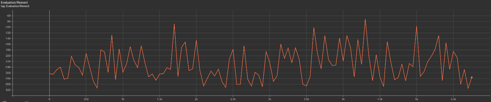

# A2C Agent for Ultimate Mortal Kombat 3

This branch contains an Advantage Actor-Critic (A2C) reinforcement learning implementation for playing Ultimate Mortal Kombat 3 using the DIAMBRA Arena environment.

## Architecture Overview

### Neural Network Architecture
- **Dual-Input Design**: Combines visual frame data with game state features
- **CNN Encoder**: Processes stacked grayscale frames using 3-layer convolutional network
- **MLP Encoder**: Handles normalized game state features (character, health, aggressor bar, timer)
- **Actor-Critic Head**: Shared representation feeding into policy (actor) and value function (critic) outputs

### Key Features
- **Frame Preprocessing**: RGB frames converted to grayscale and normalized
- **Frame Stacking**: Uses 4-frame history for temporal information
- **Feature Extraction**: Normalizes game state variables to [0,1] range
- **Temperature Scaling**: Prevents overconfident action predictions

## A2C Algorithm Description

### Overview
Advantage Actor-Critic (A2C) is a synchronous policy gradient algorithm that combines the benefits of both policy-based and value-based reinforcement learning methods. It belongs to the actor-critic family of algorithms and serves as a simplified, synchronous version of the A3C (Asynchronous Advantage Actor-Critic) algorithm.

### Core Components

#### Actor Network
- **Purpose**: Learns the policy π(a|s) - the probability distribution over actions given a state
- **Output**: Action probabilities for the discrete action space (14 actions in UMK3)
- **Loss Function**: Policy gradient loss weighted by advantages
- **Formula**: `L_policy = -log(π(a|s)) * A(s,a)`

#### Critic Network
- **Purpose**: Estimates the value function V(s) - expected return from state s
- **Output**: Scalar value representing state value
- **Loss Function**: Mean squared error between predicted and target values
- **Formula**: `L_value = MSE(V(s), R + γ*V(s'))`

#### Advantage Estimation
- **Purpose**: Reduces variance in policy gradient estimates
- **Calculation**: `A(s,a) = R - V(s)` where R is the discounted return
- **Benefit**: Tells us how much better an action is compared to the expected value in that state

### Training Process

1. **Rollout Collection**: Agent interacts with environment for n steps (128 steps), collecting states, actions, rewards, and next states

2. **Return Calculation**: 
   - Compute discounted returns: `R_t = r_t + γ*r_{t+1} + γ²*r_{t+2} + ...`
   - Bootstrap with final state value if episode doesn't terminate

3. **Advantage Calculation**: 
   - Simple advantage estimation: `A_t = R_t - V(s_t)`
   - Normalize advantages to reduce variance

4. **Policy Update**: 
   - Update actor network using policy gradient with advantage weighting
   - Encourages actions that led to better-than-expected outcomes

5. **Value Update**:
   - Update critic network to better predict state values
   - Uses computed returns as targets

6. **Entropy Regularization**:
   - Adds entropy term to encourage exploration
   - Prevents premature convergence to deterministic policies

### Mathematical Formulation

The total loss function combines three components:
```
L_total = L_policy + c1 * L_value - c2 * H(π)
```

Where:
- `L_policy = -∑ log(π(a_t|s_t)) * A_t` (policy loss)
- `L_value = ∑ (V(s_t) - R_t)²` (value loss)
- `H(π) = -∑ π(a|s) * log(π(a|s))` (entropy)
- `c1, c2` are weighting coefficients

### Advantages of A2C

1. **Reduced Variance**: Advantage estimation reduces variance compared to vanilla policy gradients
2. **Sample Efficiency**: Value function helps with more efficient learning
3. **Stability**: Synchronous updates provide more stable training than asynchronous methods
4. **Exploration**: Entropy regularization maintains exploration throughout training
5. **Generality**: Works well across various environments and action spaces

### Implementation Details in This Project

- **Synchronous Training**: Single environment, sequential rollout collection
- **Simple Advantage**: Uses `A = R - V(s)` (returns minus value estimates)
- **Shared Network**: Actor and critic share lower layers, reducing parameters
- **Gradient Clipping**: Prevents exploding gradients with max norm of 0.5
- **Temperature Scaling**: Applies temperature (1.0) to action logits for controlled exploration
- **Advantage Normalization**: Normalizes advantages to zero mean and unit variance

## File Structure

### Core Training Files
- `train_a2c.py` - Main A2C training script with complete implementation
- `environment.py` - DIAMBRA environment setup and configuration
- `evaluate_policy.py` - Policy evaluation script with deterministic/stochastic modes

### Utility Scripts
- `debug_agent.py` - Debugging script for analyzing model weights and training issues
- `add_noise.py` - Adds Gaussian noise to model weights to escape local minima

### Training Outputs
- `checkpoints/` - Model checkpoints and training state
- `runs/` - TensorBoard logging data
- `results.csv` - Evaluation results storage

## Input Processing

### Frame Processing
- Converts 128x128x3 RGB frames to grayscale using standard luminance weights
- Normalizes pixel values to [0,1] range
- Stacks 4 consecutive frames for temporal context
- Input shape: (batch_size, 4, 128, 128)

### Feature Processing
Extracts and normalizes key game state variables:
- **Character**: Player character (normalized by max 25 characters)
- **Health**: Player health (0-166, normalized to [0,1])
- **Aggressor Bar**: Special meter (0-48, normalized to [0,1])
- **Timer**: Round timer (0-100, normalized to [0,1])

## Training Configuration

### Hyperparameters
- **Learning Rate**: 1e-4 (reduced for stability)
- **Discount Factor**: 0.99
- **Entropy Coefficient**: 0.1 (increased for exploration)
- **Value Loss Coefficient**: 0.5
- **Rollout Steps**: 128
- **Max Gradient Norm**: 0.5
- **Frame Stack Size**: 4

### Training Process
1. Collects 128-step rollouts using current policy
2. Computes advantages using Generalized Advantage Estimation (GAE)
3. Updates actor-critic network using policy gradient and value function loss
4. Logs training metrics to TensorBoard
5. Periodically evaluates policy and saves checkpoints

## Usage

### Training
```bash
python train_a2c.py
```

### Evaluation
```bash
# Basic evaluation
python evaluate_policy.py --checkpoint checkpoints/latest_checkpoint.pth --n-episodes 20

# Deterministic evaluation with video recording
python evaluate_policy.py --checkpoint checkpoints/latest_checkpoint.pth --n-episodes 5 --deterministic --save-video ./videos

# Save results to CSV
python evaluate_policy.py --checkpoint checkpoints/latest_checkpoint.pth --n-episodes 10 --save-csv results.csv
```

### Debugging
```bash
# Analyze model weights and test environment
python debug_agent.py

# Add noise to escape local minimum
python add_noise.py
```

## Environment Configuration

- **Game**: Ultimate Mortal Kombat 3 (umk3)
- **Frame Shape**: 128x128 RGB (converted to grayscale)
- **Action Space**: Discrete (14 possible actions)
- **Step Ratio**: 4 (action repeated for 4 game frames)
- **Character**: Kitana (fixed for consistency)
- **Difficulty**: Level 2
- **Role**: Player 1

## Training Features

### Monitoring
- Real-time TensorBoard logging for losses and rewards
- Periodic policy evaluation episodes
- Model checkpointing every 100 episodes
- Training progress tracking with episode and step counters

### Stability Features
- Gradient clipping to prevent exploding gradients
- Temperature scaling for action distribution
- Proper reward normalization
- Graceful keyboard interrupt handling

## Implementation Details

The A2C implementation uses:
- Synchronous advantage actor-critic algorithm
- Combined loss function (policy loss + value loss + entropy bonus)
- Adam optimizer with gradient clipping
- Frame stacking using efficient deque data structure
- Proper environment handling with DIAMBRA Arena integration

This implementation is designed for research and experimentation with reinforcement learning in fighting game environments.

## Visualisation
