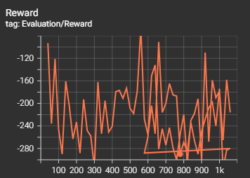
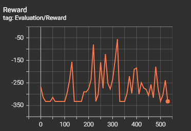

# Mortal Kombat 3 — PPO Training with DIAMBRA Arena

- **Project:** PPO training for Ultimate Mortal Kombat 3 using PyTorch and the DIAMBRA Arena environment.
- **Main scripts:** `train_ppo.py`, `environment.py`, `evaluate_policy.py`.

Check video 2 and video 3 in the `videos/` folder for gameplay footage of trained agents at different training stages. Our model is the blue character.

## Table of Contents
- [Mortal Kombat 3 — PPO Training with DIAMBRA Arena](#mortal-kombat-3--ppo-training-with-diambra-arena)
  - [Table of Contents](#table-of-contents)
  - [Overview](#overview)
  - [PPO Algorithm](#ppo-algorithm)
  - [Architecture](#architecture)
  - [Key Files](#key-files)
  - [Requirements](#requirements)
  - [Installation](#installation)
  - [Quick Start](#quick-start)
  - [Training](#training)
  - [Evaluation](#evaluation)
  - [Checkpoints \& Logging](#checkpoints--logging)
  - [Images \& Visualizations](#images--visualizations)
  - [Action Mapping \& Custom Rewards](#action-mapping--custom-rewards)
  - [Configuration Tips](#configuration-tips)

## Overview
- **Purpose:** Train a PPO agent to play Ultimate Mortal Kombat 3 (UMK3) via the DIAMBRA Arena interface.
- **Frame preprocessing & stacking:** Frames are converted to grayscale, normalized, and stacked (default `stack_size=4`). The environment uses resized frames `(128, 128)` by default.

## PPO Algorithm
Proximal Policy Optimization (PPO) is a policy gradient method for reinforcement learning that improves upon earlier algorithms like TRPO by using a clipped surrogate objective to ensure stable updates. It balances exploration and exploitation by constraining policy updates within a trust region.

Key components in this implementation:
- **Actor-Critic Architecture:** The model consists of an actor (policy) head for action selection and a critic (value) head for estimating state values.
- **Clipped Surrogate Objective:** Updates are clipped to prevent large policy changes, promoting stability.
- **Generalized Advantage Estimation (GAE):** Used for computing advantages to reduce variance in policy gradients.
- **Multi-Epoch Updates:** The collected rollout data is used for multiple optimization epochs with minibatch updates.
- **Entropy Regularization:** Added to encourage exploration by penalizing overly deterministic policies.

The training loop collects rollouts, computes returns and advantages, and performs PPO updates using the clipped objective.

## Architecture
- **CNN Encoder:** Processes stacked grayscale frames (default 4 frames) to extract visual features.
- **MLP Encoder:** Handles RAM-like features (character ID, health, aggressor bar, timer), normalized to [0,1].
- **Shared Layers:** Combines CNN and MLP outputs into a unified representation.
- **Actor Head:** Outputs action logits for the discrete action space.
- **Critic Head:** Estimates the value function for advantage computation.

## Key Files
- `train_ppo.py`: Training loop, model definition (`ProximalPolicyOpt`), frame stacking, rollout collection, PPO update, logging (TensorBoard), checkpointing.
- `environment.py`: DIAMBRA environment creation (`make_env()`), utilities to load a trained policy (`load_trained_policy()`), and an interactive `run_episode()` helper.
- `evaluate_policy.py`: Evaluation utilities — run to compute evaluation metrics; see file for usage details.

## Requirements
- Python 3.8+ recommended.
- PyTorch (GPU recommended if available).
- DIAMBRA Arena (separate installation; may require Docker/container setup) — see DIAMBRA docs.
- Common Python packages: `numpy`, `torch`, `diambra`, `tensorboard`, `opencv-python` (if needed for image handling).

## Installation
Suggested minimal install (example):

```powershell
python -m pip install torch torchvision torchaudio --index-url https://download.pytorch.org/whl/cu118
python -m pip install numpy tensorboard diambra-arena opencv-python
```

**Notes:**
- DIAMBRA installation is environment-specific. Follow DIAMBRA Arena's installation instructions (Docker or native) before running the code.

## Quick Start
1. Ensure DIAMBRA Arena is installed and configured.
2. Open `train_ppo.py` to review/modify the training config.
3. Run training: `python train_ppo.py`
4. View logs: `tensorboard --logdir runs/ppo_umk3_v7 --bind_all`
5. Evaluate: `python environment.py`

## Training
- Default training command (PowerShell):

```powershell
python train_ppo.py
```

- Default important config values (from `train_ppo.py`):
  - `stack_size`: 4
  - `learning_rate`: 2e-4
  - `n_steps`: 128
  - `gamma`: 0.99
  - `entropy_coef`: 0.1
  - `save_dir`: `checkpoints_v7`
  - `log_dir`: `runs/ppo_umk3_v7`

## Evaluation
- `environment.py` contains `make_env()` and `run_episode()` helpers. It loads a trained policy from `checkpoints/checkpoint_episode_560.pth` by default — update the path if needed.
- To run an interactive episode (uses trained policy if available, otherwise random actions):

```powershell
python environment.py
```

- Use `evaluate_policy.py` for deterministic evaluations and metrics.

## Checkpoints & Logging
- Checkpoints are saved as `checkpoint_episode_{episode}.pth` in the configured `save_dir` (default `checkpoints_v7`).
- The trainer loads the latest checkpoint on start if available.
- TensorBoard logs are written to the configured `log_dir` (default `runs/ppo_umk3_v7`). To view logs:

```powershell
tensorboard --logdir runs/ppo_umk3_v7 --bind_all
```

## Images & Visualizations
Below are visualizations from training and evaluation:

Inbuilt Diambra Reward Mechanism Model 


Reward Shaping Model - Updated Rollout

Updated rollout with custom reward shaping to encourage aggressive playstyle and faster wins.

```python
movement_ids = [0,1,2,3,4,5,6,7,8,13,14]
attack_ids = [9,10,11,12]

# # # if action chosen and no damage dealt, penalize small amount
# if action.cpu().item() in attack_ids and reward == 0:
#     reward -= 1.2  # small penalty for ineffective attack

# # give more importance to damage dealt
if reward > 0:
    reward *= 2.0  # amplify positive rewards

# # # # add custom reward for
if action.cpu().item() in attack_ids:
    reward += 2.8

# if action.cpu().item() in movement_ids:
#     reward += 0.5  # small reward for movement actions
```



Model stuck in local minima - needs further tuning 


*Note: Replace with actual image paths if needed. Use `pngs_to_video.py` to generate videos from frames.*


Added videos showing gameplay of trained agents at different training stages.

## Action Mapping & Custom Rewards
- The action space is discrete. `train_ppo.py` contains an explanatory comment listing action IDs (No-Op, Left, Up, Right, High Punch, High Kick, Low Kick, Low Punch, Run, Block, etc.). Review the inline comment in `train_ppo.py` for the exact mapping.
- The training script applies custom reward shaping (amplifying positive rewards and adding a bonus for attack actions). Inspect the `rollout()` function in `train_ppo.py` to modify.


## Configuration Tips
- To change frame resolution or step ratio, modify `environment.py`'s `EnvironmentSettings()` (e.g., `settings.frame_shape`, `settings.step_ratio`).
- To change training hyperparameters (learning rate, gamma, batch sizes, etc.) edit the `config` dict in `train_ppo.py`.
- If you want to use a different checkpoint folder, update `config['save_dir']` in `train_ppo.py` and the checkpoint path in `environment.py`.


